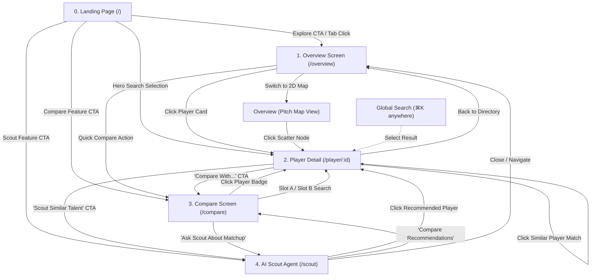

# Application Flow & UX Architecture — Eleven

> **Project**: Eleven — Football Player Style Dashboard & AI Scouting Engine  
> **Author**: Antigravity (Collaborative Planning with Jeet Shah, Dev, Pooja & Vishvam)  
> **Status**: PROPOSED APP FLOW (Awaiting Jeet's Review & Decision Sign-off)  
> **Constraints**: Locked PRD Scope (Overview, Compare, Scout Agent), Locked Nav (Logo + 3 Tabs + Search), Zero AI Slop, Ponytail Mode State (No Redux/Zustand), Grounded API Contract (`docs/api-contract.md`).

---

## 1. Executive Flow Architecture & Handoff

```
┌────────────────────────────────────────────────────────────────────────────────────────┐
│                              PUBLIC ENTRY: LANDING HERO                                │
│        Hero Showcase • Quick Player Search (⌘K) • 3 Primary Onboarding Pathways        │
└───────────────┬───────────────────────────┬───────────────────────────┬────────────────┘
                │                           │                           │
         [Explore Players]          [Dual Compare CTA]           [AI Scout CTA]
                │                           │                           │
                ▼                           ▼                           ▼
┌────────────────────────────────────────────────────────────────────────────────────────┐
│                                 ELEVEN APP SHELL                                       │
│  [Logo: ELEVEN]  │  [Tab 1: Overview]  [Tab 2: Compare]  [Tab 3: Scout Agent]  │ [⌘K Search]│
├────────────────────────────────────────────────────────────────────────────────────────┤
│                                                                                        │
│  1. OVERVIEW SCREEN (/overview)                                                        │
│     ├── 2D PCA Tactical Pitch Map (1,802 players clustered by style)                   │
│     ├── Filter Bar (Position Group, League, Age U21 Toggle, Search)                    │
│     └── Player Directory Cards / Table View                                            │
│            │                                                                           │
│            ├── [Click Player Card] ───────────────────────────┐                         │
│            └── [Click "Compare" Quick-Add] ──────────────┐   │                         │
│                                                          │   │                         │
│  2. PLAYER DETAIL SCREEN (/player/:id)                   │   │                         │
│     ├── Tactical Header (Photo, Squad, League, Archetype)│   │                         │
│     ├── 8-Metric Percentile Radar vs Cluster Centroid    │   │                         │
│     ├── GMM Soft-Clustering Probability Breakdown        │   │                         │
│     ├── Similar Players Widget (Top 5 Cosine Matches)    │   │                         │
│     └── Action CTAs: ["Compare With..." / "Ask Scout"]   │   │                         │
│            │                                             │   │                         │
│            └─────────────────────────────────────────┐   │   │                         │
│                                                      ▼   ▼   ▼                         │
│  3. COMPARE MATRIX SCREEN (/compare?p1=:id&p2=:id) ◄─────────┘                         │
│     ├── Dual Search Selectors (Slot A & Slot B)                                        │
│     ├── Overlaid Dual Radar Visualization (Crimson vs Amber)                           │
│     ├── Metric-by-Metric Delta Grid (+/- % Advantage Badges)                          │
│     └── Archetype Alignment & GMM Probability Comparison                               │
│                                                                                        │
│  4. AI SCOUT AGENT (/scout or Persistent Slide-over Drawer)                            │
│     ├── Fast Prompt Starters ("What style does X play?", "Who plays like X?")          │
│     ├── Natural Language Query Input (TF-IDF + Logistic Regression Intent Layer)       │
│     └── Interactive Synthesized Response Cards (Clickable Player Links → Detail)       │
│                                                                                        │
└────────────────────────────────────────────────────────────────────────────────────────┘
```

### 1.1 Public Landing Page Handoff
The Landing Page serves as the high-impact visual introduction (100dvh hero, stadium atmosphere, 3D showcase cards). It hands off into the core application through three explicit entry gates without authentication:
1. **Direct Exploration CTA ("Explore 1,802 Players")** $\rightarrow$ Transitions directly into `/overview`.
2. **Hero Search / Command Palette (`⌘K`)** $\rightarrow$ Selecting any player jumps immediately to `/player/:id`.
3. **Feature Action Cards** $\rightarrow$
   - *"Tactical Clustering & Pitch Map"* $\rightarrow$ `/overview?view=pitch`
   - *"Head-to-Head Compare"* $\rightarrow$ `/compare`
   - *"Natural Language Scout"* $\rightarrow$ `/scout` (or opens Scout Drawer)

---

## 2. Screen-by-Screen Navigation Map & Pathways



### Screen Navigation Details

#### Screen 0: Public Landing Page (`/`)
* **Primary Role**: Brand impression, system credentials, quick search entry.
* **Outbound Paths**:
  * Click *"Enter Dashboard"* $\rightarrow$ Navigate to `/overview`.
  * Select player in Hero Search $\rightarrow$ Navigate to `/player/:id`.
  * Click Top Navbar Tab (`Overview`, `Compare`, `Scout Agent`) $\rightarrow$ Navigate to corresponding route.
* **Back Behavior**: N/A (Root).

#### Screen 1: Overview Screen (`/overview`)
* **Primary Role**: 1,802-player directory search, position filtering, league filtering, U21 toggle, and 2D PCA cluster exploration.
* **Sub-views**:
  * **Directory Grid View**: High-density player cards with archetype pills, percentile summaries, and quick actions.
  * **2D PCA Pitch Map View**: Full tactical scatter canvas (`pca_x`, `pca_y`) with interactive archetype clusters and position centroids.
* **Outbound Paths**:
  * Click player card / pitch node $\rightarrow$ Navigate to `/player/:id` (pushes history entry).
  * Click "Add to Compare" on card $\rightarrow$ Adds player to comparison context / navigates to `/compare?p1=:id`.
  * Global Search `⌘K` selection $\rightarrow$ Navigate to `/player/:id`.
  * Tab navigation $\rightarrow$ `/compare` or `/scout`.
* **Back Behavior**: Returns to Landing Page (`/`).

#### Screen 2: Player Detail Screen (`/player/:id`)
* **Primary Role**: Complete single-player diagnostic dossier (8 per-90 metrics, radar vs cluster centroid, GMM soft probabilities, top-5 similarity recommendations).
* **Inbound Paths**: Overview cards, Pitch Map nodes, Global Search (`⌘K`), Similar Player links, Compare slot links, Scout Agent recommendations, direct deep links (`/player/bukayo_saka_eng_eng_2001_0`).
* **Outbound Paths**:
  * Click "Compare With..." button $\rightarrow$ Navigates to `/compare?p1=:id`.
  * Click any Similar Player candidate card $\rightarrow$ Navigates to `/player/:similar_id` (pushes new history entry).
  * Toggle "U21 Only" in Similar Widget $\rightarrow$ Refetches similarity with `u21_only=true` (in-place state update).
  * Click "Ask AI Scout" button $\rightarrow$ Opens Scout Agent with pre-filled query `"What style does [Player Name] play?"`.
  * Breadcrumb / Back button $\rightarrow$ Returns to `/overview` preserving previous filters/scroll.
* **Deep Link Support**: Full server-side ID resolution. If invalid ID $\rightarrow$ `404 Player Not Found` state with search fallback.

#### Screen 3: Head-to-Head Compare Screen (`/compare`)
* **Primary Role**: Side-by-side tactical breakdown of two players (Overlaid Dual Radar, metric deltas, archetype comparison).
* **URL Structure**: `/compare?p1=:player_id_1&p2=:player_id_2` (URL-driven state enables 100% shareability).
* **Inbound Paths**:
  * Direct navbar tab click (`/compare` with empty slots or default showcase pair e.g. *Saka vs Foden*).
  * From Player Detail (`/compare?p1=:current_player_id&p2=`).
  * From Scout Agent comparison recommendation.
* **Outbound Paths**:
  * Click Player A / Player B Header $\rightarrow$ Navigates to `/player/:id`.
  * Swap Player Selector $\rightarrow$ Updates URL search param `p1` or `p2`.
  * Clear comparison $\rightarrow$ Resets slot.
  * Back button $\rightarrow$ Returns to previous screen.

#### Screen 4: AI Scout Agent Screen / Panel (`/scout` or Drawer)
* **Primary Role**: Natural language scouting interface strictly locked to PRD intents:
  1. *Style Explanation*: "What style does X play?" (`explain_player`)
  2. *Similarity & Replacements*: "Who plays like X?" / "Find U21 alternatives" (`find_similar`)
  3. *Criteria Scouting*: "Find young wingers in La Liga" (`find_by_criteria`)
  4. *Player Comparison*: "Compare Saka and Yamal" (`compare_players`)
* **Inbound Paths**: Navbar tab click, Landing Page feature card, Player Detail "Ask Scout" CTA.
* **Outbound Paths**:
  * Click any referenced player chip/card in assistant response $\rightarrow$ Navigates to `/player/:id`.
  * Click "Compare these players" action chip $\rightarrow$ Navigates to `/compare?p1=:id1&p2=:id2`.
* **Back Behavior**: Returns to previous dashboard view or closes drawer.

---

## 3. Routing Architecture & URL Parameter Strategy

| Route | URL Pattern | State Location | Shareable / Deep-Linkable? |
| :--- | :--- | :--- | :--- |
| **Landing Page** | `/` | Static | Yes |
| **Overview (Directory)** | `/overview` or `/overview?pos=Forward&league=La+Liga&u21=true&search=Saka&view=grid` | `useSearchParams` (filters & view mode) | **Yes** (reloads exact filter set) |
| **Overview (Pitch Map)** | `/overview?view=pitch&cluster=Dynamic+Winger` | `useSearchParams` (`view`, `cluster`) | **Yes** |
| **Player Detail** | `/player/:playerId` | `useParams` (`playerId`) | **Yes** (canonical player URL) |
| **Compare Matrix** | `/compare?p1=:playerId1&p2=:playerId2` | `useSearchParams` (`p1`, `p2`) | **Yes** (shareable direct matchup link) |
| **AI Scout Agent** | `/scout` (or `?scout=open&q=...` if modal) | Route or URL query param | **Yes** |
| **Fallback / 404** | `*` | Static error view | No |

### State-in-URL vs Component-State Rules
1. **State in URL (Search Params / Path Params)**:
   - Selected Player ID (`/player/:playerId`)
   - Comparison Pair IDs (`/compare?p1=...&p2=...`)
   - Directory Filters (`pos`, `league`, `u21`, `q`, `view`)
   - *Rationale*: Guarantees browser forward/back buttons work seamlessly and users can copy-paste exact dashboard states into reports or share with teammates.
2. **Component Local State**:
   - Hovered scatter plot node / tooltip coordinates
   - Open/closed dropdown select menus
   - Active radar metric highlight
   - Search input typing buffer (debounced before updating URL)

---

## 4. State Ownership & Data Flow Matrix

Strictly adhering to **Ponytail Mode** (`.agents/rules/frontend.md`): **Zero Redux, Zero Zustand**. Clean React primitives + React Query caching.

```
┌────────────────────────────────────────────────────────────────────────┐
│                   SERVER STATE (React Query / Axios)                   │
│  - ['players', filters]               (GET /players)                   │
│  - ['player', playerId]               (GET /players/{id})              │
│  - ['clusters']                       (GET /clusters)                  │
│  - ['similar', playerId, u21_only]    (GET /similar/{id})              │
│  - ['health']                         (GET /health)                    │
└───────────────────────────────────┬────────────────────────────────────┘
                                    │ Cached & deduplicated across views
                                    ▼
┌────────────────────────────────────────────────────────────────────────┐
│                   APP CONTEXT (React Context - Minimal)                │
│  - CompareContext: staged compare slot buffer (p1, p2)                  │
│  - ScoutDrawerContext: drawer open/closed state (if drawer mode)       │
│  - SearchPaletteContext: global ⌘K command modal open state             │
└───────────────────────────────────┬────────────────────────────────────┘
                                    │
                                    ▼
┌────────────────────────────────────────────────────────────────────────┐
│                   LOCAL & URL STATE (useSearchParams & useState)       │
│  - URL Search Params: ?pos=&league=&u21=&p1=&p2=&view=                 │
│  - Component Local: hoverTooltips, modalAnimations, inputDebounce      │
└────────────────────────────────────────────────────────────────────────┘
```

### State Ownership Table

| Data Domain | Storage Mechanism | Lifetime | Consumers |
| :--- | :--- | :--- | :--- |
| **Players Directory List** | React Query (`['players', filters]`, `staleTime: 10m`) | Session cache | `OverviewScreen`, `ClusterMap2D`, `GlobalSearch` |
| **Player Full Profile** | React Query (`['player', id]`, `staleTime: 15m`) | Session cache | `PlayerDetailPage`, `CompareScreen` |
| **Cluster Centroids & Meta** | React Query (`['clusters']`, `staleTime: 30m`) | Static session cache | `ClusterMap2D`, `GMMBreakdownWidget`, `PlayerDetail` |
| **Similar Players Matches** | React Query (`['similar', id, u21]`, `staleTime: 10m`) | Session cache | `PlayerDetailPage` (Similar Widget), `CompareScreen` |
| **Active Comparison Pair** | URL Search Params (`?p1=...&p2=...`) + `CompareContext` | URL / In-memory | `CompareScreen`, `PlayerDetailPage` ("Add to Compare") |
| **Scout Agent Chat History** | Local `useState` in Scout Component / Session Storage | Browser session | `ScoutChatTab` / `ScoutDrawer` |
| **Command Palette (`⌘K`)** | `SearchContext` (`isOpen: boolean`) | Transient | `Navbar`, `App.jsx`, Global Keyboard Listener |

---

## 5. Loading, Empty, and Error State Specifications

Per `.agents/rules/frontend.md` and `DESIGN.md`, no raw unhandled errors or blank screens are permitted.

| Screen | Loading State | Empty State | Error State |
| :--- | :--- | :--- | :--- |
| **Overview (Directory)** | 8 shimmering glass card skeletons (`animate-pulse bg-white/5 rounded-2xl h-48`) | *"No players found matching current filters"* + Single-click *"Reset Filters"* CTA | *"Unable to connect to analytics engine (500/Offline)"* + *"Retry Connection"* button |
| **Overview (2D Pitch Map)** | Pitch canvas outline with pulsating center-circle radar rings | *"No players match filter criteria in this coordinate cluster"* | Pitch grid outline preserved with centered error toast & retry CTA |
| **Player Detail** | Full page skeleton: Avatar circle + 8-axis polygon placeholder + 2 column metric bars | N/A (Redirects to 404 if ID does not exist) | *"Player ID '[id]' not found in FBref 2024-2025 dataset"* + *"Search Player Directory"* button |
| **Compare Matrix** | Dual split skeletons (Left & Right player cards + centered radar skeleton) | Empty Slot placeholder: *"Select Player A / Player B using search or directory"* | *"Failed to load comparison data for one or more players"* + *"Reset Matchup"* |
| **AI Scout Agent** | Terminal blinking cursor + *"Scout analyzing 1,802 players..."* typing shimmer | Initial prompt suggestions: 4 fast-click starter prompt chips | *"Scout query failed (Rate limit or network timeout)"* + Pre-populated query retry |
| **Global Search (`⌘K`)** | 4-row minimal list shimmer in dropdown | *"No outfield player found for '[query]' (Min 450 mins required)"* | *"Search indexing error"* + fallback to full Directory |

---

## 6. Screen Transition Motion & Visual Rhythm

### Proposed Unified Transition Approach: **"Atmospheric Tactical Shift"**
Rather than disjointed page snaps or heavy 3D flips, all top-level route changes will share a single, unified Framer Motion transition pattern:

```jsx
// Unified Screen Wrapper Pattern
<motion.div
  initial={{ opacity: 0, y: 10, filter: "blur(4px)" }}
  animate={{ opacity: 1, y: 0, filter: "blur(0px)" }}
  exit={{ opacity: 0, y: -8, filter: "blur(2px)" }}
  transition={{ duration: 0.24, ease: [0.16, 1, 0.3, 1] }} // Apple standard spring/easeOut
  className="w-full"
>
  {children}
</motion.div>
```

### Key Motion Safeguards:
1. **Duration**: $\le 240\text{ms}$ total duration to maintain crisp, instantaneous responsiveness.
2. **GPU Optimization**: Exclusively animate `transform` (`y`), `opacity`, and lightweight backdrop filters. No layout-thrashing animations on `height` or `width`.
3. **Reduced Motion**: Wrapped with `prefers-reduced-motion` check to gracefully fall back to pure instant opacity transitions.
4. **Hero-to-App Handoff**: When clicking *"Explore 1,802 Players"* from Landing Hero, the hero player cutout smoothly scales and fades out while the navbar capsule stays fixed at the top.

---

## 7. API Contract Verification & Endpoint Mapping

Cross-checking every single screen against `docs/api-contract.md` and `backend/main.py`:

| Screen & Component | Data Need | API Endpoint | Query / Body Contract | Status in Backend |
| :--- | :--- | :--- | :--- | :--- |
| **Navbar & Header** | Total database player count & system health status | `GET /health` | None | ✅ **Fully Implemented** |
| **Overview (Directory)** | Filtered list of players (name, squad, league, position, cluster, age) | `GET /players` | `?position_group=&league=&search=&u21_only=&limit=&offset=` | ✅ **Fully Implemented** |
| **Overview (Pitch Map)** | 2D PCA coordinates (`pca_x`, `pca_y`) for all 1,802 players | `GET /players` | `?limit=1802` | ✅ **Fully Implemented** |
| **Overview (Centroids)** | Cluster names, centroid descriptions, and signature stats | `GET /clusters` | None | ✅ **Fully Implemented** |
| **Player Detail Page** | 8 per-90 metrics, position percentiles, GMM soft probabilities | `GET /players/{player_id}` | Path parameter: `player_id` | ✅ **Fully Implemented** |
| **Player Detail (Similar)** | Top 5 closest tactical matches in 8D feature space (+ U21 filter) | `GET /similar/{player_id}` | `?n=5&u21_only=false` | ✅ **Fully Implemented** |
| **Compare Matrix** | Stats and percentiles for Player A and Player B | `GET /players/{id_1}` & `GET /players/{id_2}` | Path parameters | ✅ **Fully Implemented** |
| **AI Scout Agent** | Natural language queries, intent classification & synthesized report | `POST /scout-agent/query` | Body: `{ "query": "..." }` | ✅ **Fully Implemented** |

> **Contract Audit Result**: **100% Alignment**. Every proposed view and interaction maps directly to an active, validated FastAPI endpoint. No missing endpoints or unfulfilled UI dependencies.

---

## 8. Explicit Open Questions for Jeet (Decision Matrix)

The following architectural and UX decisions are explicitly flagged for Jeet's review and sign-off before implementation proceeds.

---

### Decision 1: AI Scout Agent Presentation Mode
* **Context**: PRD scopes Scout Agent as one of the 3 locked core navigation destinations. Should it be a standalone dedicated route (`/scout`), a persistent slide-over drawer accessible from any screen, or a hybrid?
* **Option A (Dedicated Route `/scout`) [Recommended]**: Full-page tactical terminal experience with prominent prompt suggestions, large report cards, and clean chat history.
  * *Pros*: Maximum visual breathing room for multi-player comparison cards, clean URL `/scout`, simple state management.
  * *Cons*: User leaves their current screen context to consult the AI.
* **Option B (Persistent Slide-Over Drawer / Modal)**: Right-hand slide-over drawer accessible via `⌘K` or floating quick-trigger badge from any screen.
  * *Pros*: Can query the scout while looking at a player profile or compare screen.
  * *Cons*: Cramped UI for complex multi-player radar/comparison responses; harder responsive layout on tablet/mobile.
* **Option C (Hybrid)**: Dedicated route `/scout` for deep inquiries + quick "Ask Scout" trigger on Player Detail that opens a focused drawer.

---

### Decision 2: 2D Tactical Pitch Map Integration in Overview
* **Context**: Overview needs to present both the 1,802-player directory list and the 2D PCA Cluster Pitch Map.
* **Option A (Segmented Tab Toggle in Overview) [Recommended]**: Top-right toggle pills: `[ Grid View ▦ ]` | `[ 2D Tactical Map 🗺️ ]` inside `/overview` (persisted in URL `?view=pitch` vs `?view=grid`).
  * *Pros*: Keeps navigation strictly to 3 top navbar tabs per DESIGN.md; seamless context switching.
  * *Cons*: User cannot view both side-by-side simultaneously on desktop.
* **Option B (Split-Screen Dashboard Layout on Wide Viewports $\ge 1440\text{px}$)**: Left 60% 2D Pitch Scatter canvas, Right 40% scrollable player directory list with synchronized hover highlighting.
  * *Pros*: High-density professional analytics workstation feel.
  * *Cons*: Higher cognitive load on smaller laptop viewports (1366x768 / 1440x900).

---

### Decision 3: Compare Tray Persistence
* **Context**: When a user is browsing the directory or viewing a player profile, how should they stage players for comparison?
* **Option A (URL Query Direct Navigation) [Recommended]**: Clicking "Compare" on a player card immediately navigates to `/compare?p1=:id`, where Slot B has an active search picker to select the opponent.
  * *Pros*: Minimal code, zero persistent tray clutter, instant clarity.
  * *Cons*: User cannot stage 2 players in the directory before navigating.
* **Option B (Floating Bottom Compare Dock / Tray)**: Adding a player docks them into a floating bottom capsule (`[ Slot A: Saka ] vs [ Slot B: + Select ] -> Compare (2)`).
  * *Pros*: Tactile e-commerce style staging workflow.
  * *Cons*: Adds UI clutter over tables/footer and extra global Context state.

---

### Decision 4: Mobile & Tablet Responsive Layout Strategy
* **Context**: Football radar charts and high-density 8-metric comparison tables require adequate screen width.
* **Proposed Strategy**:
  * **Desktop ($\ge 1024\text{px}$)**: Full side-by-side dual radar overlay and 8-column percentile tables.
  * **Tablet / Mobile ($< 1024\text{px}$)**:
    - Navbar collapses to compact liquid capsule with tab icons.
    - Compare Screen switches from side-by-side to stacked card layout with a tab toggle `[ Player A ] | [ Player B ] | [ Overlaid Radar ]`.
    - 2D Pitch Map includes pinch-to-zoom and touch tooltips.
* *Question for Jeet*: Confirm if responsive collapse strategy meets university submission and evaluation criteria.

---

### Decision 5: 3D Visual Effects vs 60fps Performance Floor
* **Context**: DESIGN.md specifies Apple Liquid Glassmorphism and premium tactical cards.
* **Proposed Balance**: Use CSS-only 3D perspective transforms (`perspective: 1000px`, `transform: rotateX(...) rotateY(...)`) driven by mouse position on hover for desktop, with automatic disabling on mobile touch devices (`hover: none`) to preserve 60fps rendering.

---

## 9. Definition of Done & Next Steps

- [x] Every screen transition, deep link, and back-navigation path mapped.
- [x] Routing structure & URL parameter scheme defined.
- [x] State ownership matrix verified (Zero Redux/Zustand, React Query caching).
- [x] Loading, empty, and error states specified for all screens.
- [x] Unified 240ms motion transition defined.
- [x] 100% of data needs cross-checked against `docs/api-contract.md`.
- [x] Explicit Open Questions decision matrix compiled for Jeet.

**Next Action**: Jeet to review `APP_FLOW.md`, select preferred options in Section 8, and authorize Phase 7 component implementation.
